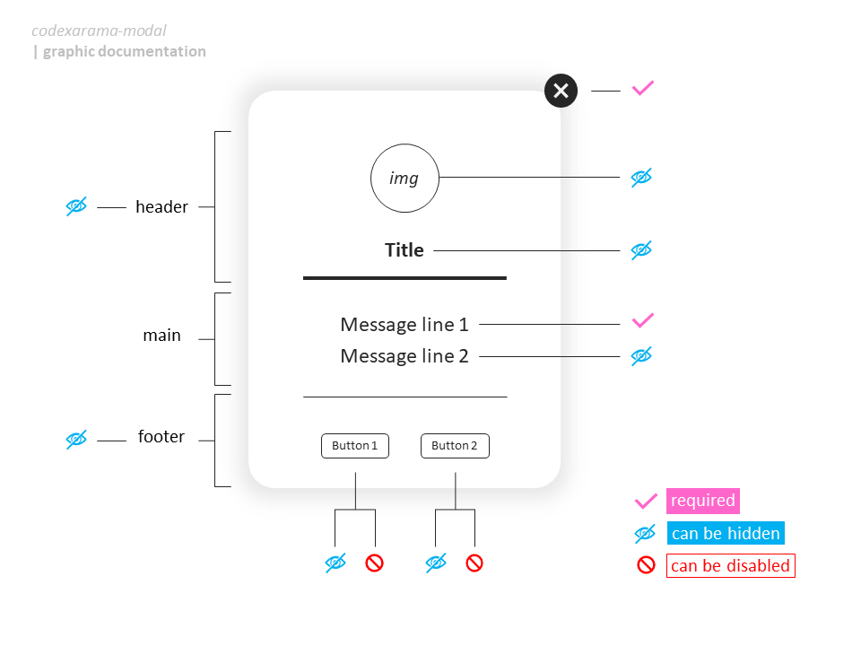
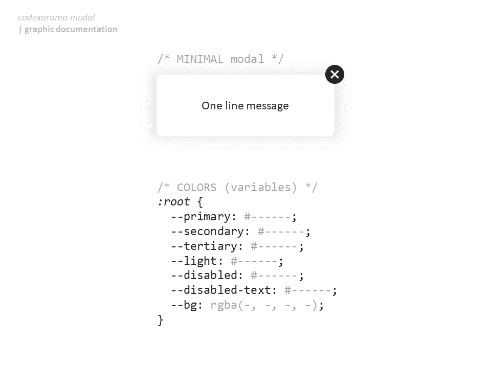
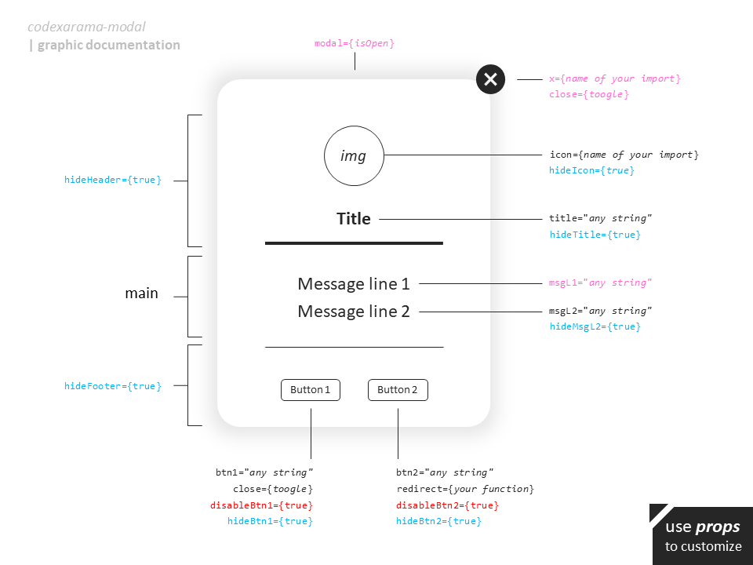
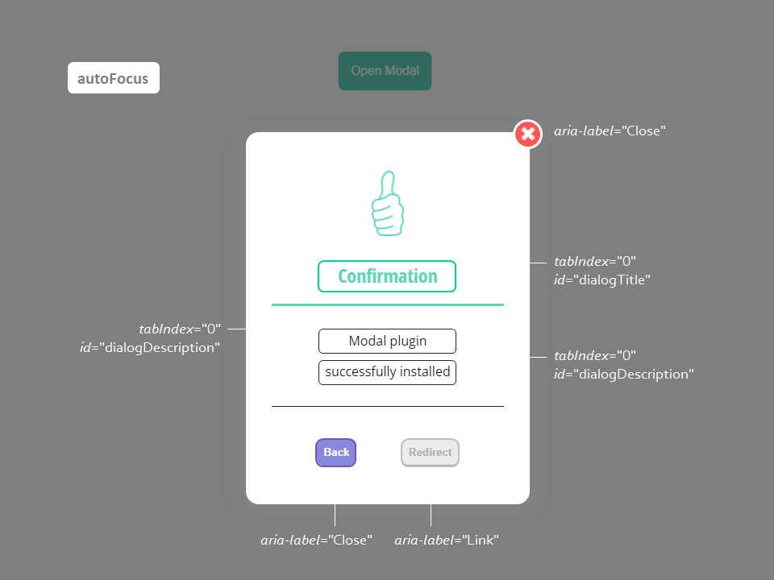
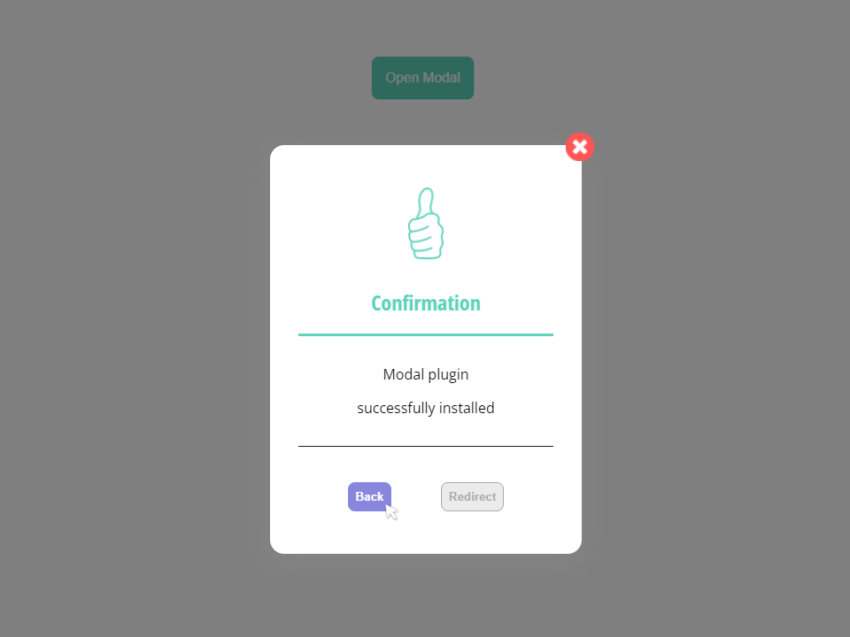

# Codexarama Modal

A fully customizable Modal component for React apps

> _using React Portal, the Modal is mounted on its own node as a distinct child of App body_

## Features

☑️ **useModal**

    custom hook to mount / unmount Modal container

☑️ **VARIOUS ITEMS**

    🔘 close button (img)
    🔘 Modal container illustration (img)
    🔘 title
    🔘 message line 1
    🔘 message line 2
    🔘 button 1
    🔘 button 2

☑️ **THAT YOU CAN**

    🔘 EDIT ---- (string type)
    🔘 HIDE ---- (exept required)
    🔘 DISABLE - (button type)
    🔘 STYLE --- (css files)
        ✔ separated color variables
        ✔ clear and logical items attributes




## Getting started guide

### Source [codexarama-modal](https://www.npmjs.com/package/codexarama-modal)

### Install

**With npm run the following command**

    npm i codexarama-modal

**With yarn run the following command**

    yarn add codexarama-modal

### Props

| Name            | Type     | Description                        | Status       |
| --------------- | -------- | ---------------------------------- | ------------ |
| **modal**       | Boolean  | mount Modal or null              | **required** |
| **close**       | Function | on click : close modal             | **required** |
| **x**           | String   | close image source                 | **required** |
| **icon**        | String   | modal container image source       | optional     |
| **hideIcon**    | Boolean  | mount item or null               | optional     |
| **title**       | String   | any                                | optional     |
| **hideTitle**   | Boolean  | mount item or null               | optional     |
| **msgL1**       | String   | any                                | **required** |
| **msgL2**       | String   | any                                | optional     |
| **hideMsgL2**   | Boolean  | mount item or null               | optional     |
| **btn1**        | String   | any                                | optional     |
| **disableBtn1** | Boolean  | add or remove 'disabled' attribute | optional     |
| **hideBtn1**    | Boolean  | mount item or null               | optional     |
| **btn2**        | String   | any                                | optional     |
| **disableBtn2** | Boolean  | add or remove 'disabled' attribute | optional     |
| **hideBtn2**    | Boolean  | mount item or null               | optional     |
| **redirect**    | Function | on click : redirect to chosen url  | optional     |
| **hideHeader**  | Boolean  | mount item or null               | optional     |
| **hideFooter**  | Boolean  | mount item or null               | optional     |



### Accessibility

    - only semantic html tags,
    - required ARIA attributes,
    - custom focus handlers,

    to improve the user experience while keyboard navigation.

**ARIA attributes**

```jsx
 <section
    tabIndex={-1}
    role="dialog"
    aria-modal="true"
    id="modal-component"
    aria-label="pop up message"
    aria-labelledby="dialogTitle"
    aria-describedby="dialogDescription"
    className="modal-container"
  >
  {/* code */}
  </section>
```

**Focus handling**

    🔘 Auto focus on modal when open
    🔘 Focus on each element by "Tab" (or "shift" + "Tab") key press
    🔘 So that content can be read by screen readers
    🔘 Escape key press to close modal

**Custom focus to fit with your App design**



### Use

**Import the plugin & its hook in your React component**

```jsx
import { Modal, useModal } from 'codexarama-modal';
```

**Import UseNavigate hook if you need to implement redirect function**

```jsx
import { useNavigate } from 'react-router-dom'; // !!! IN ROUTING CONTEXT
```

**Use the default assets to beautify your modal _(like exemple)_**

```jsx
      <Modal
        x={close}
        icon={thumbUp}
        // or icon={validate}
      />
```

**& CREATE YOURS !**

**_Here is a fully exemple with helpfull comments_**

```jsx
import { Modal, useModal } from 'codexarama-modal';
import { useEffect } from 'react';
// import { useNavigate } from 'react-router-dom'; // !!! IN ROUTING CONTEXT

export default function Exemple() {
  const { isOpen, toggle, escToClose } = useModal();

  // detects when escape key pressed to close the modal
  // and stops event propagation when occured
  useEffect(() => {
    window.addEventListener('keydown', escToClose);
    return () => window.removeEventListener('keydown', escToClose);
  });

  // // !!! NEEDS APP ROUTING
  // const redirectTo = useNavigate();
  // function goTo() {
  //   redirectTo('url'); // replace 'url' by yours
  // }

  return (
    <>
      <button className="open-modal-btn" onClick={toggle}>
        Open Modal
      </button>

      <Modal
        // MINIMAL (required)
        modal={isOpen}                  // useModal hook
        close={toggle}                  // useModal hook
        x={close}                       // replace with the name of your import

        // ADDITIONAL (optional)
        icon={thumbUp}                  // replace with the name of your import
        title="Confirmation"            // replace with any string
        msgL1="Modal plugin"            // replace with any string
        msgL2="successfully installed"  // replace with any string
        btn1="Back"                     // replace with any string
        btn2="Redirect"                 // replace with any string
        // redirect={goTo}              // !!! NEEDS APP ROUTING

        // DISABLE (optional)
        // disableBtn1={true}           // decomment to disable btn1
        disableBtn2={true} // comment to enable btn2

        // HIDE (optional)
        // hideIcon={true}              // decomment to hide icon
        // hideTitle={true}             // decomment to hide title
        // hideMsgL2 ={true}            // decomment to hide msgL2
        // hideBtn1 ={true}             // decomment to hide btn1
        // hideBtn2 ={true}             // decomment to hide btn2
        // hideHeader={true}            // decomment to hide header
        // hideFooter={true}            // decomment to hide footer
      />
    </>
  );
}
```



**copy and past the CSS to personalize it if needed**

    Style sheets are included with the package, so the modal is already customized like the exemple.
    If you want to customize then to fit with your will, here are the links to get them :

[Download modal.css](./src/lib//styles/modal.css)

[Download exemple.css](./src/lib/styles/exemple.css)

